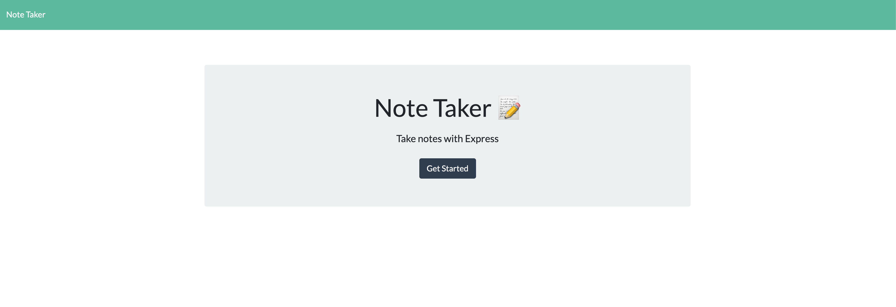
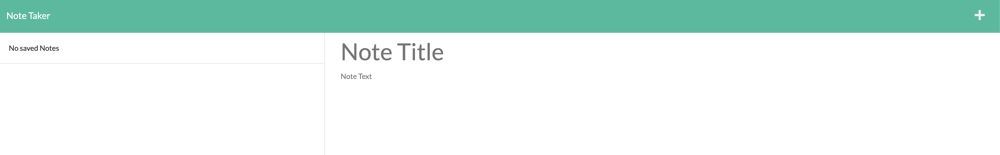

# Note Taker

  

  ## Description
  A note app, when a user types in a new note, it is added to the array of notes. If a user clicks on an existing note is appears with its note description and title. 
  
  ## Table Of Contents
  * [Installation](#installation)
  * [Usage](#usage)
  
  * [Contributing](#contributing)
  * [Tests](#tests)
  * [Questions](#questions)
  
  ## Installation
  
  
  ## Usage
  
  
  
  
  
  ## Contributing
  Nick Broglio
  
  ## Tests
  Application works!
  
  ## Questions 
  If you have any questions, contact me at:
  
  * Github: Nick Broglio
  * Email: nickrbroglio@gmail.com
  